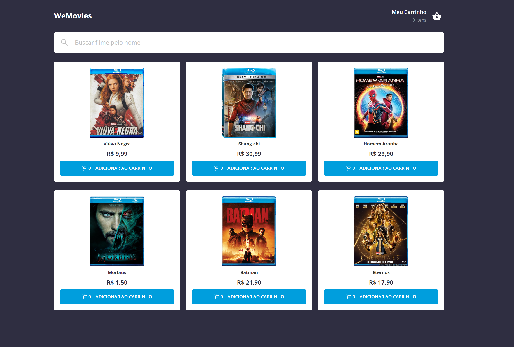

<p align="center">
  WeMovies
</p>

<p align="center">
  
</p>

<br>

## 🧪 Tecnologias

Esse projeto foi desenvolvido com as seguintes tecnologias:

- [ReactJS](https://react.dev/)
- [Vite](https://vitejs.dev/)
- [StyledComponents](https://styled-components.com/)
- [json-server](https://github.com/typicode/json-server/tree/v0)
- [React Query](https://tanstack.com/query/latest)

## 💻 Projeto

Um ecommerce onde voce pode comprar seus filmes favoritos.

## 🚀 Como executar

Clone o projeto e acesse a pasta do mesmo.

```bash
$ git clone https://github.com/CesarNeo/challenge-wefit-ecommerce.git
$ cd challenge-wefit-ecommerce
```

Para iniciá-lo, siga os passos abaixo:

```bash
# Instalar as dependências
$ npm install

# Iniciar o json-server (por padrão está com um delay de 700 milissegundos)
$ npm run server

# Iniciar o projeto
$ npm run dev
```

O app estará disponível no seu browser pelo endereço http://localhost:5173/.
